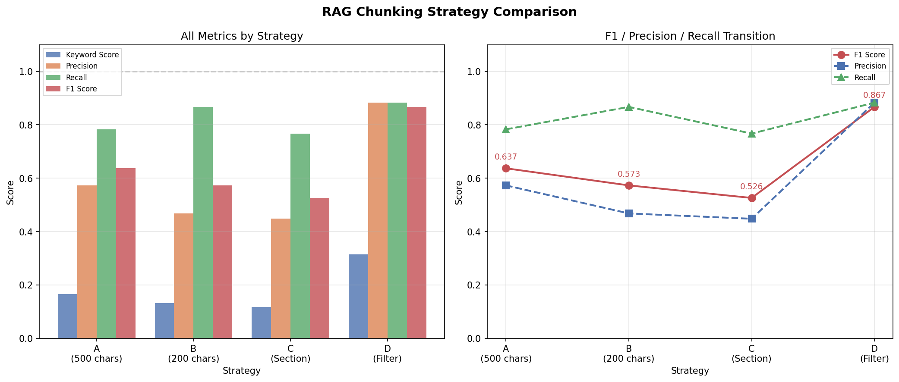
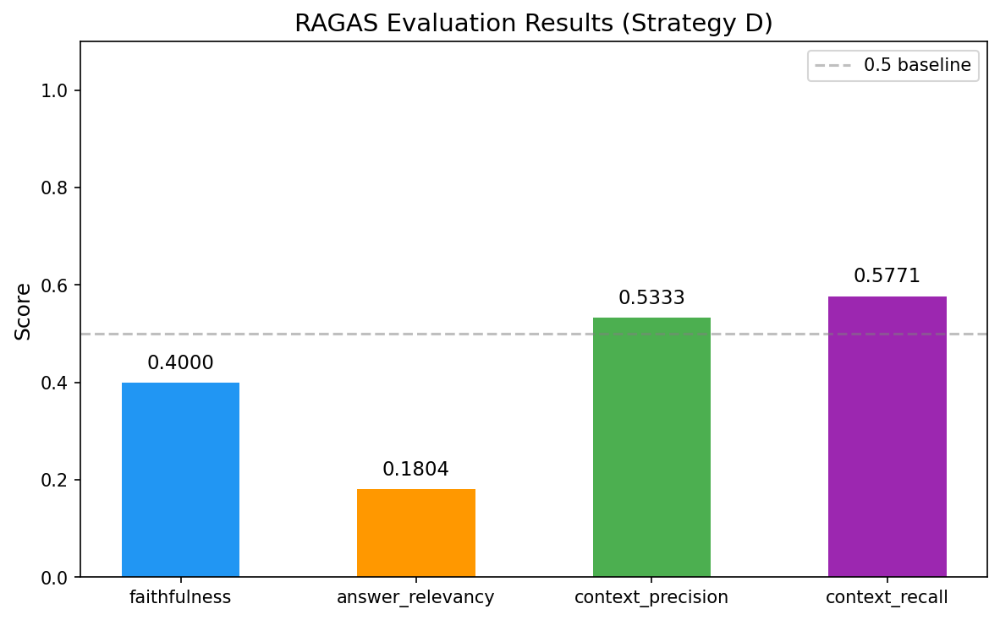

# 医薬品添付文書 × 診療マニュアル RAGシステム

糖尿病治療薬の代表的な薬剤クラスから選定した医薬品添付文書（8種）と診療ガイドライン（1種）を対象としたプロトタイプ質問応答システム。実際の糖尿病治療薬はより多く存在し、本システムはその一部をカバーする。  
定量評価基盤の構築・チャンク戦略の比較実験・薬剤師資格を活かしたドメイン設計に重点を置いたポートフォリオ作品。

---

## 目次

- [プロジェクト概要](#プロジェクト概要)
- [本プロジェクトの特徴](#本プロジェクトの特徴)
- [技術スタック](#技術スタック)
- [システム構成](#システム構成)
- [RAG実装の詳細](#rag実装の詳細)
- [評価設計と実験結果](#評価設計と実験結果)
- [セットアップ](#セットアップ)
- [エージェント的機能について](#エージェント的機能について)
- [既知の課題と考察](#既知の課題と考察)
- [プロジェクト構成](#プロジェクト構成)
- [開発フェーズ](#開発フェーズ)

---

## プロジェクト概要

| 項目 | 内容 |
|---|---|
| 対象ドメイン | 糖尿病治療薬 |
| 対象文書 | 添付文書8種（経口薬6・注射薬2）＋ 糖尿病標準診療マニュアル2025 |
| 主な機能 | 質問応答・参照元チャンク表示・回答のファイル保存 |
| 実行環境 | Docker（ローカル）／ AWS EC2（t3.small・東京リージョン） |

**対象添付文書：**

| ファイル | 薬剤名 | 薬剤クラス |
|---|---|---|
| metformin.pdf | メトグルコ錠 | ビグアナイド系 |
| glimepiride.pdf | アマリール錠 | SU薬 |
| sitagliptin.pdf | ジャヌビア錠 | DPP-4阻害薬 |
| linagliptin.pdf | トラゼンタ錠 | DPP-4阻害薬（腎機能低下対応） |
| empagliflozin.pdf | ジャディアンス錠 | SGLT2阻害薬 |
| semaglutide.pdf | オゼンピック皮下注 | GLP-1受容体作動薬 |
| insulin_glargine.pdf | ランタスXR注 | 持効型インスリン |
| insulin_aspart.pdf | ノボラピッド注 | 超速効型インスリン |

---

## 本プロジェクトの特徴

### ① 定量評価基盤の構築

10問の評価用質問セットを設計し、**検索品質**と**回答品質**の2段階で定量評価を実装。

**検索品質評価（Phase 4〜5）：** ファイルレベルのPrecision・Recall・F1スコアで評価。  
評価指標の選択理由：MRRは複数正解を無視するため不適切（Q10のように複数ファイルが正解になるケースがある）。NDCGは重要度スコアの付与が必要で設計の前提と合わない。Precision・Recall・F1は複数の正解を同等に評価でき、今回の設計と整合する。

**回答品質評価（Phase 6）：** RAGASによる自動評価を追加実装。F1スコアが高くても回答品質が低い部分があることを数値で示し、「検索品質の評価だけでは不十分」という結論を導出。

### ② チャンク戦略4種の比較実験（Phase 5）

同一の評価用質問セットで4戦略を比較。単なるチャンクサイズ調整では精度改善が見込めないこと、**メタデータを活用した検索設計が有効**であることを数値で実証した。

| 戦略 | 内容 | F1スコア |
|---|---|---|
| A（ベースライン） | 文字数ベース・chunk_size=500 | 0.637 |
| B | 文字数ベース・chunk_size=200 | 0.573 |
| C | セクションベース分割のみ | 0.526 |
| **D（採用）** | **セクション分割＋メタデータフィルタ** | **0.867** |

**主要な発見：**

- チャンクサイズを小さくしても精度は上がらない（B < A）。チャンクが小さいと文脈が失われ、特徴の薄いベクトルが生成される。
- セクションベース分割単体では最悪の結果（C < A）。セクション見出しをpage_contentに含めるとベクトルが具体的内容方向に引っ張られ、クエリとの類似度が低下する。セクション分割はメタデータフィルタと組み合わせて初めて効果を発揮する。
- 「ベクトル検索に全てを任せる」設計より「メタデータで絞り込んでからベクトル検索する」設計が有効。

### ③ 薬剤師資格保有者によるドメイン設計

- 厚労省統一書式の番号付き見出し（「2. 禁忌」「11. 副作用」等）に対応したセクション分割を実装
- 禁忌・用法用量・副作用など9カテゴリのLLMによる質問分類を設計（question_patterns）
- 添付文書の旧形式PDFに関する既知の課題を特定し、XMLデータソースへの移行を将来課題として明記
- 副作用に関する質問を「副作用_一般」と「副作用_合併症」に分割し、患者背景ごとに参照セクションを切り替える設計を仮説検証の上で実装

### ④ AWS EC2へのデプロイ

- t3.small（2GB）インスタンスでの動作確認済み
- systemdによる自動起動設定済み
- セキュリティグループで必要なポートのみ開放（SSH・8000・8501）

---

## 技術スタック

| カテゴリ | 技術 |
|---|---|
| 言語 | Python |
| RAGフレームワーク | LangChain |
| ベクトルDB | ChromaDB 0.5.18 |
| LLM | OpenAI GPT-4o-mini |
| APIサーバー | FastAPI |
| WebUI | Streamlit |
| PDF処理 | PyMuPDFLoader（日本語エンコーディング対応） |
| 評価 | RAGAS・独自評価基盤（Precision / Recall / F1） |
| インフラ | Docker・AWS EC2（t3.small・東京リージョン） |

---

## システム構成

```
[Streamlit WebUI :8501]
        ↓ HTTP POST /ask
[FastAPI :8000]
        ↓
[ChromaDB（セクション×薬剤名フィルタ）] + [OpenAI API]
```

| サービス | ポート | 用途 |
|---|---|---|
| rag | 8888 | JupyterLab（実験・評価用） |
| api | 8000 | FastAPI（RAG処理・回答生成） |
| ui | 8501 | Streamlit（WebUI） |

UIはAPIのヘルスチェック通過後に起動（`depends_on` + `condition: service_healthy`）。

---

## RAG実装の詳細

### 採用戦略（戦略D）の処理フロー

```
① 質問受信
② LLMで質問カテゴリ判定（禁忌・用法用量・副作用_一般・副作用_合併症・腎機能 等）
③ ガイドライン関連質問をキーワードマッチで判定（コスト節約のためLLM不使用）
④ LLMで薬剤名抽出（商品名・一般名どちらにも対応）
⑤ セクション番号×薬剤名×doc_typeでChromaDB絞り込み検索
⑥ 重複除去・上位5件に絞る
⑦ LLMで回答生成（プロンプトの制約：文書外の情報は回答しない）
```

### question_patterns（質問カテゴリとセクション番号のマッピング）

| カテゴリ | 参照セクション |
|---|---|
| 禁忌 | 1・2・10 |
| 用法用量 | 6・7・8・9 |
| 副作用_一般 | 11・11.1・11.2 |
| 副作用_合併症 | 9・11・11.1・11.2 |
| 腎機能 | 2・7・9.2・16 |
| 妊婦 | 2・9・9.5 |
| 相互作用 | 1・2・10 |
| 薬物動態 | 8・9・16 |
| 作用機序 | 15・18 |
| 薬剤比較 | 4・7・8・9・14・16・18 |

**設計上のトレードオフ：** セクションを絞ると適合率が上がるが再現率が下がる。副作用カテゴリの分割（一般・合併症）はこのトレードオフに対する対処として仮説検証を行い採用した。他カテゴリへの適用は今後の課題。

---

## 評価設計と実験結果

### 評価用質問セット（10問）

| ID | カテゴリ | 質問 | 正解ファイル |
|---|---|---|---|
| Q01 | 禁忌 | メトホルミンの禁忌 | metformin.pdf |
| Q02 | 用法用量 | グリメピリドの用法・用量 | glimepiride.pdf |
| Q03 | 副作用 | エンパグリフロジンの主な副作用 | empagliflozin.pdf |
| Q04 | 禁忌 | オゼンピックの禁忌 | semaglutide.pdf |
| Q05 | 薬剤比較 | 腎機能低下時に使用できる糖尿病薬 | linagliptin.pdf・empagliflozin.pdf |
| Q06 | 薬剤比較 | ジャヌビアとトラゼンタの腎機能低下時の使い分け | sitagliptin.pdf・linagliptin.pdf |
| Q07 | 薬剤比較 | インスリン グラルギンとアスパルトの違い | insulin_glargine.pdf・insulin_aspart.pdf |
| Q08 | ガイドライン | 血糖コントロール目標 | diabetes_manual_2025.pdf |
| Q09 | ガイドライン | 2型糖尿病の薬物療法の第一選択薬 | diabetes_manual_2025.pdf |
| Q10 | 横断検索 | 心血管疾患合併時の推奨薬 | empagliflozin.pdf・semaglutide.pdf・diabetes_manual_2025.pdf |

評価セットは10問と小規模であり統計的な有意性の担保には不十分。傾向の把握と戦略選択の根拠としての位置づけ。

**キーワードスコアについて：** LLMの回答に正解キーワードが何割含まれているかを測る独自指標（含まれたキーワード数 / 全キーワード数）。各質問に対して医学的に必須な用語・数値をあらかじめ定義し、回答の網羅率を評価する。

### チャンク戦略比較結果（Phase 5）

| 戦略 | キーワードスコア | 適合率 | 再現率 | F1スコア |
|---|---|---|---|---|
| A（500文字） | 0.166 | 0.573 | 0.783 | 0.637 |
| B（200文字） | 0.133 | 0.468 | 0.867 | 0.573 |
| C（セクション分割のみ） | 0.118 | 0.448 | 0.767 | 0.526 |
| **D（セクション＋フィルタ）** | **0.315** | **0.883** | **0.883** | **0.867** |



### RAGAS評価結果（Phase 6・戦略D）

| 指標 | スコア | 解釈 |
|---|---|---|
| Faithfulness | 0.400 | 回答できた質問では文書に基づいた回答になっている |
| Answer Relevancy | 0.180 | 「提供された文書には記載がありません」という回答が多いため低スコア |
| Context Precision | 0.533 | 取得チャンクの約半数は不要なものが混入 |
| Context Recall | 0.577 | 必要な情報の約6割を取得できている |



**Phase 5との統合的考察：** F1=0.867と高い検索品質を示す戦略Dでも、RAGASで見ると回答品質に課題がある。これは「ファイルは取得できても回答に使えるチャンクが取得できていない」または「プロンプトの制約により回答を生成できない」問題があることを示しており、F1スコアだけでは不十分で回答品質の評価も必要という結論を数値で示せた。

**プロンプト設計のトレードオフ：** プロンプトの制約緩和はAnswer Relevancyを上げるがハルシネーションリスクが高まる。医療領域では特に「動くシステム」と「安全に使えるシステム」は別物であり、保守的な設計を維持する判断をした。

---

## セットアップ

### ローカル環境

```bash
git clone https://github.com/KK-raven/diabetes-rag.git
cd diabetes-rag
cp .env.example .env  # OPENAI_API_KEYを設定
# PDFファイルをdata/raw/package_inserts/とdata/raw/guidelines/に配置
docker compose up
```

| アクセス先 | URL |
|---|---|
| WebUI | http://localhost:8501 |
| API（Swagger） | http://localhost:8000/docs |
| JupyterLab | http://localhost:8888 |

### AWS EC2デプロイ

```bash
# EC2インスタンスへの接続
ssh -i your-key.pem -o ServerAliveInterval=60 ec2-user@<EC2のIPアドレス>

# リポジトリのクローン・環境変数設定
git clone https://github.com/KK-raven/diabetes-rag.git
cd diabetes-rag
cp .env.example .env
nano .env  # OPENAI_API_KEYを設定

# PDFファイルの転送（ローカルから実行）
scp -i your-key.pem -r ./data/raw ec2-user@<EC2のIPアドレス>:~/diabetes-rag/data/

# コンテナ起動
docker-compose up -d
```

| アクセス先 | URL |
|---|---|
| WebUI | http://\<EC2のIPアドレス\>:8501 |
| API（Swagger） | http://\<EC2のIPアドレス\>:8000/docs |

**動作確認済み環境：**

| 環境 | 確認状況 |
|---|---|
| ローカル（Docker Desktop・Mac） | ✅ |
| AWS EC2（Amazon Linux 2023・t3.small） | ✅ |

### ログの確認方法

```bash
# リアルタイム確認
docker logs -f diabetes-rag-api

# 直近100行を確認
docker logs --tail 100 diabetes-rag-api

# Docker Compose使用時
docker compose logs -f api
```

### 注意事項

PDFファイルは著作権の関係でリポジトリに含まれていない。  
- 添付文書：[医薬品医療機器情報提供ホームページ（PMDA）](https://www.pmda.go.jp/PmdaSearch/iyakuSearch/) から入手可能  
- ガイドライン：[日本糖尿病・生活習慣病ヒューマンデータ学会](http://human-data.or.jp/) から入手可能

---

## エージェント的機能について

自然言語による回答保存機能を実装している。

> この機能は実用性よりも「LLMが会話の意図を判定してツールを呼び出す」  
> Tool Use・Function Callingの概念デモとして実装しています。  
> 「保存して」「JSONで保存して」「いや、やっぱりいい」などの自然言語を入力すると、  
> LLMがFew-Shotで保存意図と保存形式（txt / JSON）を判定してファイル保存を実行します。

---

## 既知の課題と考察

### ① PDFのセクション見出し誤検出問題

- **症状：** 一部PDFで「23. 主要文献」内の文献番号がセクション見出しとして誤検出される  
- **原因：** 正規表現が文献番号の形式（数字＋）に誤マッチ  
- **対処：** 否定先読み `(?![）\)])` を追加、インデント付き見出し対応として `\s*` を追加  
- **根本解決策：** 構造化されたデータソース（XML）の使用。PMDAはほぼすべての薬剤でXMLデータを公開しており、将来的な精度向上が見込める

### ② sitagliptin.pdf（PDFレイアウト起因の番号認識問題）

2021年の厚労省統一化以前の書式であり、PDFのレイアウト構造の問題でセクション番号をPyMuPDFが正しく認識できないためセクション分割が機能しない。全チャンクが「（推定）」表示になる。全薬剤を新形式に揃えることは現実的でないため、旧形式への対応は今後の課題。PMDAのXMLデータへの移行が根本解決策として有効。

### ③ Q10（横断検索）の限界

「心血管疾患合併時の推奨薬」は添付文書単体では対応できない質問。推奨薬のエビデンスはガイドラインに記載されており、添付文書とガイドラインを横断する検索設計が必要。F1=0.333にとどまる。ガイドラインのチャンクにも内容に基づいたメタデータを付与してメタデータフィルタを実装することで改善できる余地があるが、今回は実装していない。

### ④ ChromaDB 0.5.18の永続化問題

ChromaDB 0.5.18ではpersist()メソッドが廃止され自動保存のはずだが、Dockerセッション終了後にデータが消える事例が発生。起動時にコレクションの件数を確認し、0件の場合は再構築する処理を実装して対処。

### ⑤ question_patternsのサブセクション問題

副作用カテゴリについては `11.1`・`11.2` のサブセクション番号を明示することで精度改善を確認した。他カテゴリも同様の問題が存在する可能性があり、仮説検証は今後の課題。

---

## プロジェクト構成

```
diabetes-rag/
├── api/
│   └── main.py              # FastAPI：RAG処理・回答生成
├── ui/
│   └── app.py               # Streamlit：WebUI
├── data/
│   ├── raw/
│   │   ├── package_inserts/ # 添付文書PDF（gitignore対象）
│   │   └── guidelines/      # ガイドラインPDF（gitignore対象）
│   ├── chroma/              # ChromaDB永続化（gitignore対象）
│   └── saved/               # 保存された回答（gitignore対象）
├── notebooks/               # 実験・評価ノートブック
├── docker-compose.yml
├── Dockerfile
└── requirements.txt
```

---

## 開発フェーズ

| フェーズ | 内容 |
|---|---|
| Phase 1 | Docker + JupyterLab環境構築 |
| Phase 2 | PDF収集（添付文書8種・ガイドライン1種）・メタデータ設計 |
| Phase 3 | PDF処理・チャンク分割・ChromaDB登録（516チャンク） |
| Phase 4 | 評価用質問セット設計・Precision/Recall/F1評価基盤構築 |
| Phase 5 | チャンク戦略A〜D比較実験・戦略D採用 |
| Phase 6 | RAGAS評価導入・ChromaDB永続化問題解決 |
| Phase 7 | FastAPI・Streamlit実装・section_pattern修正・question_patterns仮説検証・EC2デプロイ |
